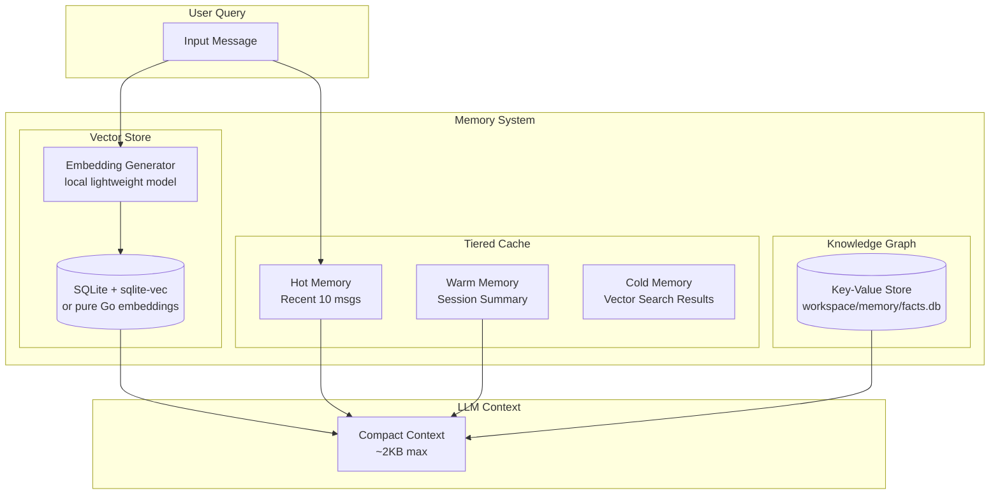
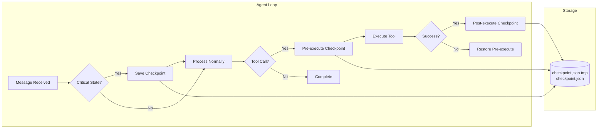
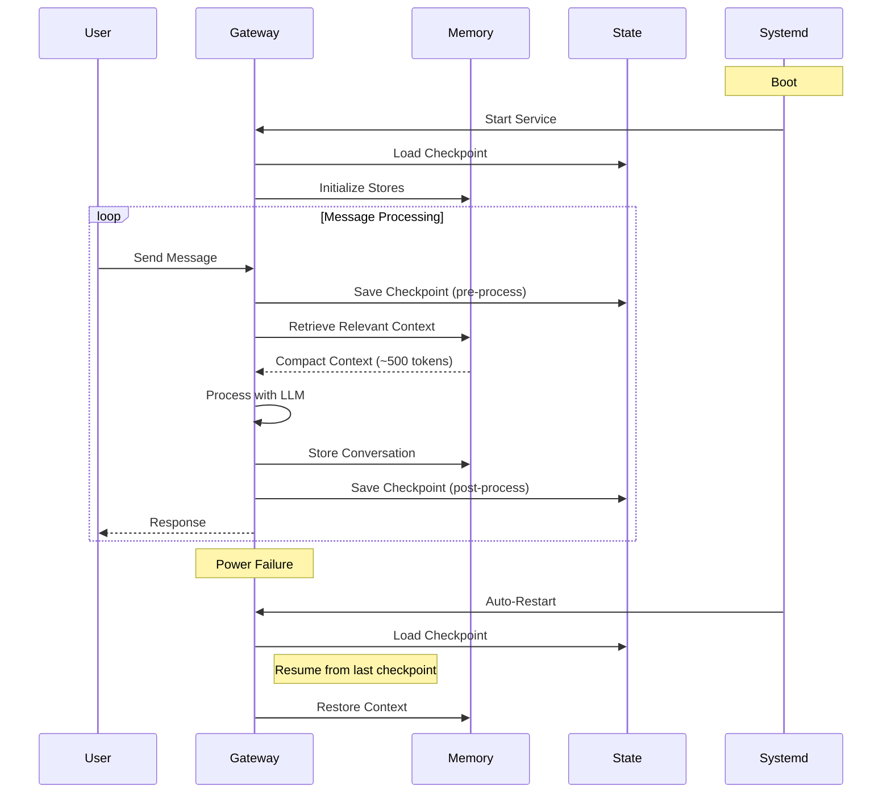

# Long-Term Memory, State Recovery & Auto-Start Architecture

## Overview

This document outlines the architecture for three major improvements to picoclaw:

1. **Lifelong Memory**: Persistent memory that does not bloat context tokens
2. **State Recovery**: Exact state reconstruction after power failures/restarts
3. **Auto-Start Daemon**: Systemd service for automatic startup

---

## 1. Lifelong Memory Architecture

### Problem
Current system loads all memory into context, causing token bloat (19K tokens for a "Ping" message). We need:
- Permanent storage of all facts/conversations
- Minimal token usage (only relevant memories)
- No external dependencies (runs on edge devices like LicheeRV Nano)

### Solution: Hybrid RAG + Key-Value Memory

#### 1.1 Architecture Components



#### 1.2 Data Flow

1. **On Message**:
   - Extract entities and facts using lightweight NER (Named Entity Recognition)
   - Generate embedding for the query
   - Search vector store for similar past conversations
   - Retrieve relevant facts from knowledge graph
   - Build minimal context with only relevant memories

2. **On Response**:
   - Store conversation in vector DB
   - Extract and store key facts
   - Update knowledge graph relationships

#### 1.3 Storage Structure

```
workspace/
└── memory/
    ├── facts.db          # SQLite: key-value facts (user preferences, projects)
    ├── vectors.db        # SQLite + sqlite-vec: conversation embeddings
    ├── sessions/         # Compressed session archives
    │   └── 20250101_*.json.zst
    └── graph/            # Relationship graph (optional)
        └── relationships.json
```

#### 1.4 Implementation Phases

**Phase 1: Knowledge Graph (Quick Win)**
- Store facts as key-value pairs
- Example: `user.preferences.editor = "nvim"`
- Simple JSON file, no embeddings needed
- ~500 lines of code

**Phase 2: Local Embeddings**
- Use lightweight embedding model (all-MiniLM-L6-v2, ~20MB)
- Pure Go implementation or CGO binding
- Store in SQLite with sqlite-vec extension

**Phase 3: Session Archival**
- Compress old sessions with zstd
- Only keep recent 3 sessions in memory
- Archive older sessions to disk

#### 1.5 API Design

```go
// pkg/memory/lifelong.go
type LifelongMemory struct {
    facts      *FactStore      // Key-value facts
    vectors    *VectorStore    // Embeddings search
    sessions   *SessionArchive // Compressed history
}

// Store a fact with optional tags
func (lm *LifelongMemory) StoreFact(key string, value interface{}, tags []string) error

// Retrieve relevant memories for a query
func (lm *LifelongMemory) Retrieve(query string, limit int) ([]Memory, error)

// Get compact context for LLM (max 2KB)
func (lm *LifelongMemory) GetContext(query string) string
```

---

## 2. State Recovery System

### Problem
On power failure or gateway restart, the agent loses:
- Current conversation state
- Pending tool executions
- User context

### Solution: Checkpoint-Based Recovery

#### 2.1 Checkpoint Architecture



#### 2.2 State to Persist

```go
// pkg/state/checkpoint.go
type Checkpoint struct {
    Version       int                    `json:"version"`
    Timestamp     time.Time              `json:"timestamp"`
    SessionID     string                 `json:"session_id"`
    
    // Conversation state
    Messages      []Message              `json:"messages"`
    CurrentTool   *ToolExecution         `json:"current_tool,omitempty"`
    
    // Context
    ActiveAgent   string                 `json:"active_agent"`
    Channel       string                 `json:"channel"`
    ChatID        string                 `json:"chat_id"`
    
    // Recovery metadata
    LastAction    string                 `json:"last_action"`
    RetryCount    int                    `json:"retry_count"`
}
```

#### 2.3 Recovery Flow

1. **On Startup**:
   ```go
   func (al *AgentLoop) Recover() error {
       checkpoint := state.LoadCheckpoint()
       if checkpoint == nil {
           return nil // Fresh start
       }
       
       // Restore session
       session := al.sessions.GetOrCreate(checkpoint.SessionID)
       session.SetHistory(checkpoint.Messages)
       
       // Resume interrupted tool
       if checkpoint.CurrentTool != nil {
           return al.resumeToolExecution(checkpoint.CurrentTool)
       }
       
       return nil
   }
   ```

2. **On Graceful Shutdown**:
   - Save final checkpoint
   - Mark as "clean shutdown"

3. **On Crash Recovery**:
   - Detect unclean shutdown
   - Restore from last checkpoint
   - Resume or retry last action

#### 2.4 Storage Strategy

```
workspace/state/
├── checkpoint.json       # Latest checkpoint (atomic write)
├── checkpoint.json.tmp   # Write-in-progress
└── history/              # Old checkpoints (keep 5)
    ├── checkpoint_001.json
    └── checkpoint_002.json
```

---

## 3. Auto-Start Daemon (Systemd)

### Solution: Systemd Service + Install Command

#### 3.1 Systemd Service Template

```systemd
# /etc/systemd/system/picoclaw-gateway.service
[Unit]
Description=PicoClaw Gateway Service
After=network.target
Wants=network.target

[Service]
Type=simple
User=%USER%
Group=%GROUP%

# Working directory
WorkingDirectory=%WORKSPACE%

# Environment
Environment="PATH=/usr/local/bin:/usr/bin:/bin"
Environment="HOME=%HOME%"
EnvironmentFile=-/etc/picoclaw/gateway.env

# Binary location
ExecStart=%BINARY% gateway start --workspace %WORKSPACE%

# Restart policy
Restart=always
RestartSec=5
StartLimitInterval=60s
StartLimitBurst=3

# Graceful shutdown
TimeoutStopSec=30
KillSignal=SIGTERM

# Logging
StandardOutput=journal
StandardError=journal
SyslogIdentifier=picoclaw-gateway

[Install]
WantedBy=multi-user.target
```

#### 3.2 CLI Commands

```bash
# Install systemd service
picoclaw service install --user    # User service (recommended)
picoclaw service install --system  # System service (requires root)

# Service management
picoclaw service start
picoclaw service stop
picoclaw service restart
picoclaw service status
picoclaw service logs              # View logs
picoclaw service uninstall
```

#### 3.3 Implementation

```go
// cmd/picoclaw/internal/service/command.go
package service

var InstallCmd = &cobra.Command{
    Use:   "install",
    Short: "Install picoclaw as a systemd service",
    RunE: func(cmd *cobra.Command, args []string) error {
        userMode, _ := cmd.Flags().GetBool("user")
        
        // Generate service file
        config := ServiceConfig{
            User:      os.Getenv("USER"),
            Binary:    getBinaryPath(),
            Workspace: getWorkspace(),
        }
        
        if userMode {
            return installUserService(config)
        }
        return installSystemService(config)
    },
}

func installUserService(config ServiceConfig) error {
    // Write to ~/.config/systemd/user/picoclaw-gateway.service
    path := filepath.Join(os.Getenv("HOME"), ".config/systemd/user/picoclaw-gateway.service")
    
    // Generate from template
    content := generateServiceFile(config)
    
    if err := os.WriteFile(path, []byte(content), 0644); err != nil {
        return err
    }
    
    // Enable and start
    exec.Command("systemctl", "--user", "daemon-reload").Run()
    exec.Command("systemctl", "--user", "enable", "picoclaw-gateway").Run()
    exec.Command("systemctl", "--user", "start", "picoclaw-gateway").Run()
    
    fmt.Println("User service installed and started!")
    fmt.Println("Check status: systemctl --user status picoclaw-gateway")
    return nil
}
```

#### 3.4 Auto-Recovery on Boot

The systemd service ensures:
- Starts on boot (`WantedBy=multi-user.target`)
- Restarts on crash (`Restart=always`)
- Network dependency (`After=network.target`)
- Environment isolation

---

## 4. Integration Flow



---

## 5. Implementation Roadmap

### Milestone 1: State Recovery (Week 1-2)
- Add checkpoint struct and save/load logic
- Integrate into AgentLoop
- Add recovery on startup
- Test crash scenarios

### Milestone 2: Knowledge Graph Memory (Week 2-3)
- Implement FactStore with SQLite
- Add fact extraction from conversations
- Integrate with MemoryStore
- Benchmark token reduction

### Milestone 3: Systemd Service (Week 3)
- Create service command
- Add install/uninstall logic
- Test on Linux systems
- Document setup

### Milestone 4: Vector Search (Week 4-5)
- Integrate sqlite-vec
- Add embedding generation
- Implement similarity search
- Optimize for embedded devices

### Milestone 5: Session Archival (Week 6)
- Implement compression
- Archive old sessions
- Search archived sessions
- Storage cleanup policies

---

## 6. Configuration

```json
{
  "memory": {
    "enabled": true,
    "mode": "hybrid",
    "max_context_tokens": 2000,
    "vector_store": {
      "enabled": true,
      "backend": "sqlite-vec",
      "embedding_model": "local"
    },
    "facts": {
      "enabled": true,
      "auto_extract": true
    }
  },
  "state": {
    "checkpoint_interval": 30,
    "max_checkpoints": 5,
    "auto_recover": true
  },
  "service": {
    "auto_start": true,
    "restart_policy": "always"
  }
}
```

---

## 7. Key Benefits

1. **Token Efficiency**: ~90% reduction in context size
2. **Persistence**: Never lose conversation history
3. **Reliability**: Automatic recovery from crashes
4. **Convenience**: Zero-touch startup after reboot
5. **Edge Compatible**: Works on resource-constrained devices

---

## 8. Files to Create/Modify

### New Files
```
pkg/memory/
├── lifelong.go           # Main interface
├── facts.go              # Knowledge graph
├── vectors.go            # Vector store
├── archive.go            # Session compression
└── context.go            # Context builder

pkg/state/
├── checkpoint.go         # Checkpoint logic (extend existing)

cmd/picoclaw/internal/service/
├── command.go            # CLI commands
├── install.go            # Systemd install
└── templates/
    └── service.tpl       # Service file template
```

### Modified Files
```
pkg/agent/loop.go         # Integrate checkpointing
pkg/agent/memory.go       # Integrate lifelong memory
pkg/session/manager.go    # Add compression
```
